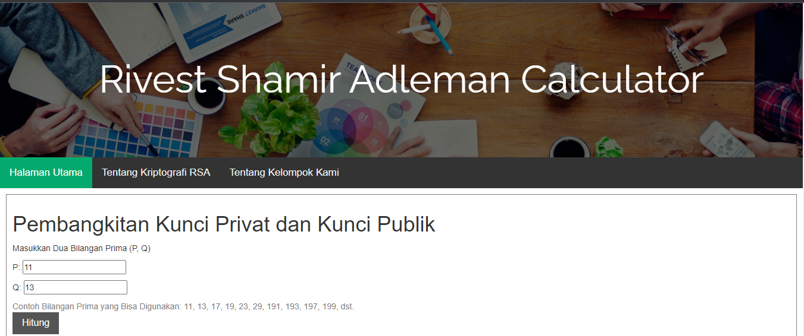
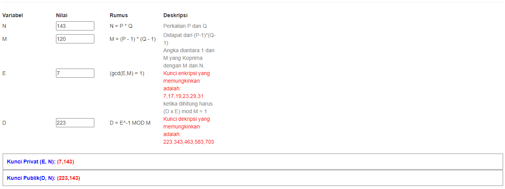
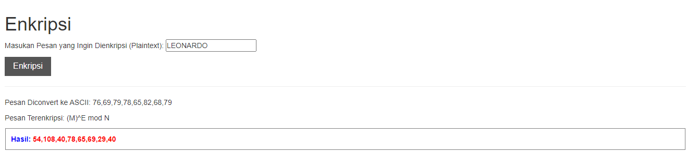
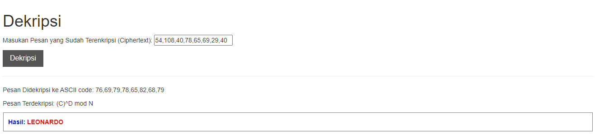

# Rivest Shamir Adleman Calculator

This repository is a final project from Cryptography  Class, Teknik Informatika Universitas Padjadjaran. 

** RSA di bidang kriptografi adalah sebuah algoritma pada enkripsi public key. RSA merupakan algoritma pertama yang cocok untuk digital signature seperti halnya enkripsi, dan salah satu yang paling maju dalam bidang kriptografi public key. RSA masih digunakan secara luas dalam protokol e-commerce, dan dipercaya dalam mengamankan dengan menggunakan kunci yang cukup panjang. 

Algoritma RSA merupakan salah satu algoritma kunci asimetris. “RSA (dari Rivest-Shamir-Adleman) adalah sebuah kriptografi kunci publik yang berdasarkan pada eksponensial terbatas pada modulo bilangan bulat N(ZN) di mana N adalah sebuah bilangan bulat gabungan dari dua faktor besar (yaitu semi-prime).”(Kiviharju, 2017).**

 

## Credits
| NPM           | Name        |
| ------------- |-------------|
| 140810190022  | Muhammad Diva Eka A.    |
| 140810190030  | Azhar Jauharul Umam    |
| 140810190038  | Leonardo Septian D. |
## Notable Assumption and Design App Details

Fitur-fitur yang terdapat pada aplikasi dapat dideskripsikan sebagai berikut:

Button / Details     | Features   
:---------         | :----- 
Pembangkit Kunci   |  Melakukan kalkulasi pembangkit kunci kriptografi RSA
Enkripsi           |  Melakukan kalkulasi enkripsi kriptografi RSA
Dekripsi           |  Melakukan kalkulasi dekripsi kriptografi RSA
Reset              |  Memulai ulang aplikasi